# Arbeitszeit-Rechner

Single-File-Webapp zum täglichen Erfassen der Arbeitszeit in **AE (Arbeitseinheiten, 1 AE = 10 min)**. Mobile-first, offline-fähig, keine Server-Komponente — alle Daten bleiben im Browser.

**Version:** 1.11.5 · **Live:** [marvdevlabs.github.io/arbeitszeit](https://marvdevlabs.github.io/arbeitszeit/)

<p align="center">
  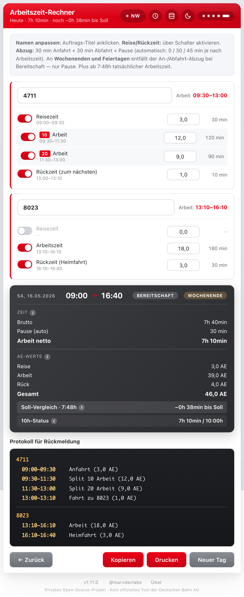
</p>

---

## Funktionen

### Eingabe

- **5-Step-Assistent** mit Punkte-Indikator: Bundesland → Bereitschaft → Datum/Zeit/Anzahl → SAP-Nummern → AE-Werte
- **Alle 16 Bundesländer** wählbar (Pflichtfeld, bleibt persistent)
- **Bereitschaft** Ja/Nein legt Standard-Startzeit fest (09:00 / 06:30)
- **Datum frei wählbar** — auch nachträgliches Erfassen vergessener Tage möglich
- **Splits** pro Auftrag (10, 11, 20, 29, 40, 50) — jeder gewählte Split bekommt eine eigene AE-Eingabezeile

### Berechnung

- **Live-Berechnung** bei jeder Eingabe
- **Sollarbeitszeit 7:48h** netto (ohne Anfahrt/Abfahrt/Pause)
- **Fester Abzug** 30 min Anfahrt + 30 min Abfahrt
- **An Wochenenden & Feiertagen mit Bereitschaft entfällt der An-/Abfahrt-Abzug** — nur Pause
- **Automatische Pause** je nach Bruttozeit: 0 min / 30 min / 45 min
- **10h-Limit** nach §3 ArbZG mit Warn-Modal und Auto-Revert beim Korrigieren

### Feiertage je Bundesland

- **Bundeseinheitliche Feiertage** automatisch (Neujahr, Karfreitag, Ostermontag, 1. Mai, Christi Himmelfahrt, Pfingstmontag, Tag der Deutschen Einheit, 25./26.12.)
- **Länderspezifische Feiertage** korrekt zugeordnet (z.B. Fronleichnam in BW/BY/HE/NW/RP/SL, Heilige Drei Könige in BW/BY/ST, etc.)
- **Bewegliche Feiertage** über Gauß'sche Osterformel — funktioniert für jedes Jahr

### Verlauf

- **Letzte 14 Tage** werden automatisch beim „Neuer Tag starten" archiviert
- **Beim Öffnen mit alten Daten:** Modal-Frage „Weiterarbeiten oder in Verlauf archivieren?"
- **Pro Eintrag:** Wochentag, Datum, Bereitschafts-/Feiertags-Badge, Anzahl Aufträge, Gesamt-AE
- **Erneut abrufbar:** vollständiges Protokoll mit Kopier-Funktion
- **Einzelne Einträge oder kompletten Verlauf löschbar**

### Export & Backup

- **Kopieren** — Klartext-Protokoll in die Zwischenablage (für Mail, Slack, etc.)
- **Drucken** — A4 quer, optimiert für 1-Seiten-PDF (System-Druck-Dialog)
- **JSON-Backup** — komplette App-Daten herunterladen (Tag + Verlauf + Bundesland + Theme)
- **JSON-Restore** — Backup einlesen, alle Daten überschreiben

### Komfort & Polish

- **Live-Schicht-Status** im Header (Step 5) — „Heute · 7h 30min · noch −18 min bis Soll" — farbig nach Status
- **Info-Tooltips** bei Fachbegriffen (Zeit / AE-Werte / Soll / 10h)
- **Dark / Light Mode** mit System-Erkennung
- **Custom Reset-Modal** statt Browser-Confirm
- **10h-Modal mit Auto-Revert** — bei „Werte korrigieren" wird der letzte zu hoch eingegebene Wert automatisch zurückgesetzt
- **Über-Modal** mit Author, Kontakt-Link und Datenschutz-Statement

### PWA & Offline

- **Service Worker** — App funktioniert auch ohne Internet (im Tunnel, Funkloch)
- **Web App Manifest** — Android-Install-Banner („App installieren")
- **Apple-Touch-Icon** — iOS „Zum Home-Bildschirm" mit eigenem App-Icon
- **Safe-Area-Insets** — Notch-fest auf iPhone
- **Eigenes Stoppuhr-Icon** auf Anthrazit-Hintergrund

---

## Anleitung

### Schritt 1 — Bundesland wählen

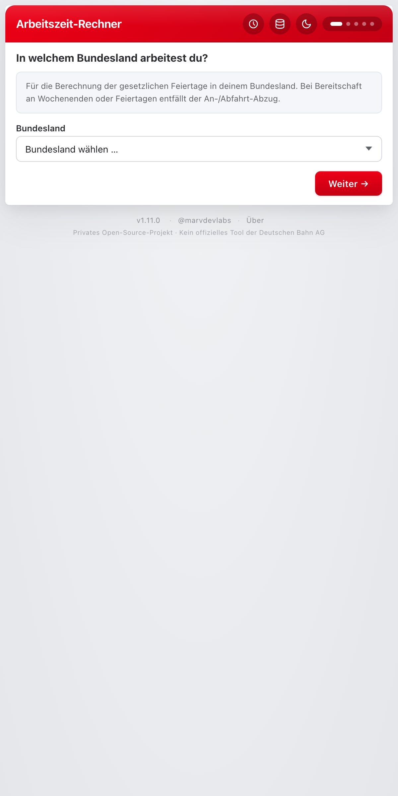

Die App startet **immer** bei der Bundesland-Auswahl. Pflichtfeld — ohne Auswahl geht es nicht weiter. Die letzte Wahl bleibt vorausgewählt, du klickst beim nächsten Mal einfach durch.

Im Header oben rechts erscheint nach der Auswahl ein kleines Pill mit dem Kürzel (z.B. **NW**) — Klick darauf bringt dich jederzeit zurück zu Schritt 1.

<br clear="all">

### Schritt 2 — Bereitschaft?

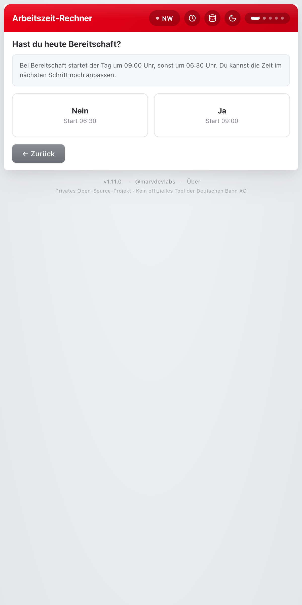

**Nein** → Tag startet um **06:30**
**Ja** → Tag startet um **09:00**

Die Startzeit kannst du im nächsten Schritt noch frei anpassen.

<br clear="all">

### Schritt 3 — Datum, Startzeit, Anzahl Aufträge

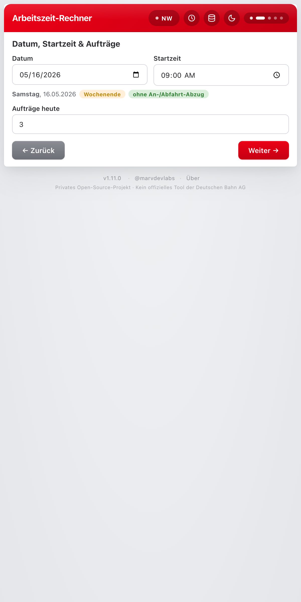

**Datum** ist automatisch heute, aber frei wählbar — auch in der Vergangenheit, falls du einen Tag nachträgst. Direkt darunter siehst du:

- **Wochentag** ausgeschrieben
- bei Wochenende oder Feiertag einen **Hinweis-Tag**
- bei Bereitschaft + Sa/So/Feiertag den grünen Hinweis **„ohne An-/Abfahrt-Abzug"**

**Aufträge heute** legt fest, wie viele Auftrags-Karten in Schritt 4/5 erzeugt werden.

<br clear="all">

### Schritt 4 — SAP-Nummern und Splits

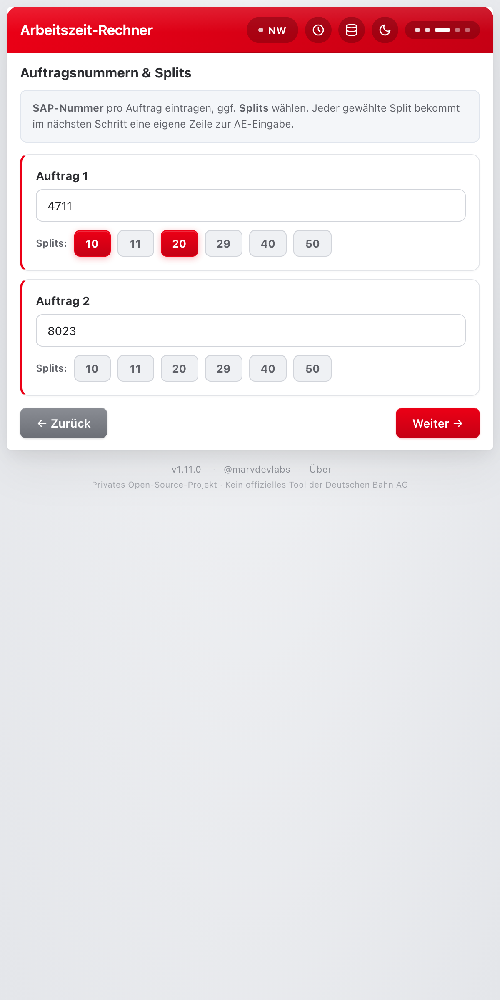

Pro Auftrag eine **SAP-Nummer** eintragen. Falls Splits relevant sind, eines oder mehrere aus **10, 11, 20, 29, 40, 50** auswählen. Jeder gewählte Split bekommt im nächsten Schritt eine eigene Zeile zur AE-Eingabe.

<br clear="all">

### Schritt 5 — AE-Werte erfassen

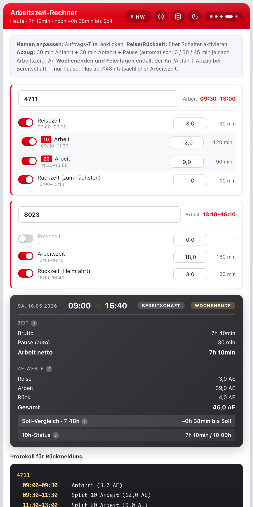

Pro Auftrags-Karte:

- **Auftrags-Titel** (klickbar zum Umbenennen — SAP-Nummer ist Default)
- **Reisezeit** (Schalter aktiviert die Eingabe, Default 0,5 AE)
- **Arbeitszeit** — pro Split eine eigene Zeile, alles in AE (1 AE = 10 min)
- **Rückzeit** zum nächsten Auftrag oder als Heimfahrt

Die berechneten Uhrzeiten links neben den Eingabefeldern aktualisieren sich live, ebenso die Übersicht ganz unten — und der **Live-Status oben im Header**.

<br clear="all">

### Übersicht am Tagesende

<p align="center">
  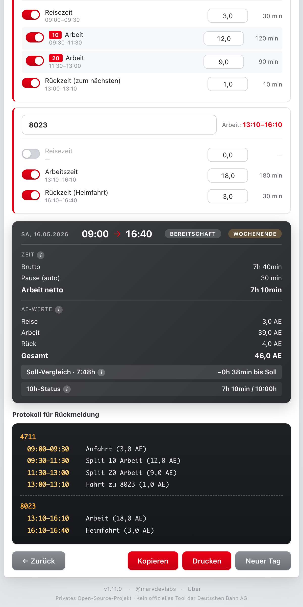
</p>

- **Zeit:** Brutto, Pause (automatisch), Netto-Arbeitszeit
- **AE-Werte:** Reise / Arbeit / Rück / Gesamt
- **Soll-Vergleich:** grün wenn 7:48h erreicht, gelb mit „+x" bei Plus, sonst „−x bis Soll"
- **10h-Status:** Warnstufe bei Überschreitung der gesetzlichen Höchstarbeitszeit nach §3 ArbZG
- Kleine **i-Icons** neben den Abschnitten erklären die Fachbegriffe per Tap

### Aktionen am Ende

- **Kopieren** — vollständiges Klartext-Protokoll in die Zwischenablage
- **Drucken** — System-Druck-Dialog (PDF-Speichern dort wählbar, A4 quer)
- **Neuer Tag** — öffnet das Reset-Bestätigungs-Modal

---

## Neuer Tag starten

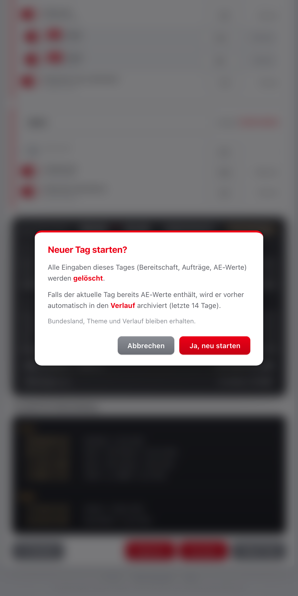

Klick auf **Neuer Tag** öffnet das Bestätigungs-Modal.

Bei Bestätigung wird der aktuelle Tag **automatisch in den Verlauf archiviert** (sofern AE-Werte vorhanden), dann startet ein neuer Tag bei Step 1. Bundesland, Theme und Verlauf bleiben erhalten.

<br clear="all">

## Verlauf

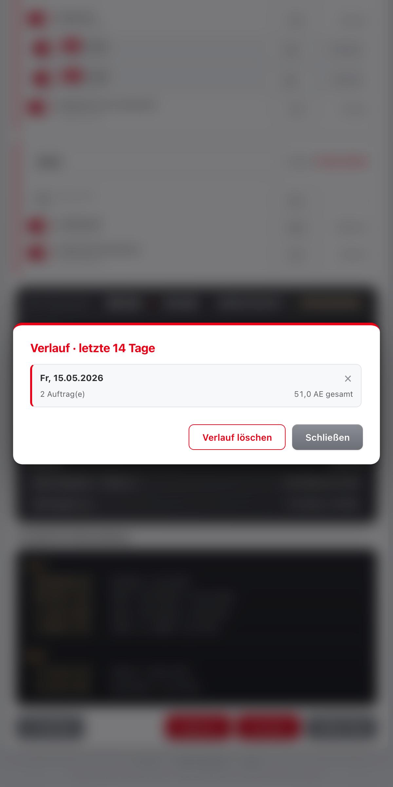

Das **Uhren-Icon** im Header öffnet den Verlauf. Listet die letzten 14 archivierten Tage mit Datum, Wochentag, ggf. Bereitschaft- und Feiertags-Badge, Anzahl Aufträge und Gesamt-AE.

- **Klick auf einen Eintrag** → komplettes Klartext-Protokoll, direkt erneut kopierbar
- **× rechts oben** → einzelnen Eintrag löschen (mit Bestätigung)
- **„Verlauf löschen"** → kompletten Verlauf entfernen (mit Bestätigung)

Ältere Einträge werden bei Überschreitung von 14 Tagen automatisch verworfen.

<br clear="all">

## Daten-Sicherung

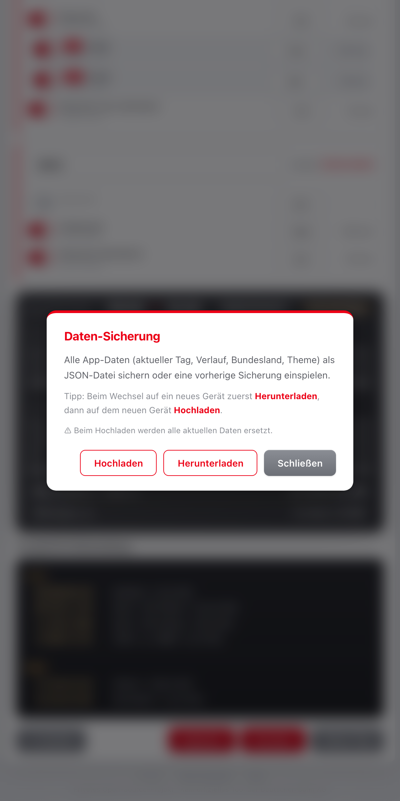

Das **Disketten-Icon** im Header öffnet die Daten-Sicherung.

- **Herunterladen:** JSON-Datei mit allem (aktueller Tag, Verlauf, Bundesland, Theme) — Dateiname `arbeitszeit-backup-YYYY-MM-DD.json`
- **Hochladen:** Backup-Datei wählen → alle Daten werden überschrieben

Sichere Geräte-Wechsel-Strategie: vorher auf altem Gerät runterladen, AirDrop/Mail an neues Gerät, dort hochladen.

<br clear="all">

## Tipps & Tricks

- **Bundesland-Pill im Header** ist klickbar → springt jederzeit zurück zu Step 1 (z.B. bei Dienstreise in ein anderes Bundesland)
- **Auftrags-Namen** kannst du in Step 5 direkt im Titel-Feld umbenennen — Standard ist die SAP-Nummer, du kannst aber freie Namen vergeben
- **Reise-/Rückzeit** werden über Toggle-Schalter aktiviert — wenn nicht aktiv, zählen sie nicht zur Rechnung
- **Datum nachträglich erfassen:** in Step 3 das Datum einfach auf den vergangenen Tag stellen, der Rest läuft normal
- **Mehrere Splits auf einem Auftrag** verteilen die Arbeitszeit auf separate AE-Felder, die einzeln summiert werden
- **PWA-Installation** auf iOS: in Safari öffnen → Teilen → „Zum Home-Bildschirm" — App läuft danach im Vollbild ohne Adressleiste, auch offline
- **Theme-Toggle** (Sonne/Mond im Header) reagiert auf System-Einstellung beim ersten Start, danach manuell setzbar
- **Es gibt ein paar kleine Geheimnisse im Footer und im Header** — wer's findet darf darüber lachen 😉

---

## Tech-Stack

- **Single-File HTML** — eine `index.html` enthält alles (HTML, CSS, JS)
- **Vanilla JavaScript** — keine Dependencies, keine Build-Tools
- **CSS Custom Properties** für Light/Dark-Theme
- **LocalStorage** für Persistenz (Tag + Verlauf + Bundesland + Theme)
- **Service Worker** (`sw.js`) — Offline-Cache via stale-while-revalidate
- **Web App Manifest** (`manifest.json`) — PWA-Install-Banner auf Android
- **Hosting:** GitHub Pages

### Lokal entwickeln

```bash
git clone https://github.com/marvdevlabs/arbeitszeit.git
cd arbeitszeit
python3 -m http.server 8000
# Browser: http://localhost:8000
```

Bearbeite `index.html` und neu laden — kein Build-Schritt, kein npm install.

### Deployment

Live-Version läuft über **GitHub Pages** vom `main`-Branch. Push reicht.

---

## Logik im Kurzüberblick

| Wert | Erklärung |
|---|---|
| 1 AE | 10 Minuten |
| Sollarbeitszeit | 7 h 48 min netto (ohne An-/Abfahrt und Pause) |
| Fester Abzug | 30 min Anfahrt + 30 min Abfahrt |
| An WE/Feiertag mit Bereitschaft | **kein** An-/Abfahrt-Abzug — nur Pause |
| Pause automatisch | 0 min bei < 6h Arbeit · 30 min bei 6–9h · 45 min bei > 9h |
| Höchstarbeitszeit | 10 h inkl. An-/Abfahrt (§3 ArbZG) |
| Plus-Zeit | wird ab Überschreitung von 7:48h netto ausgewiesen |
| Splits | 10, 11, 20, 29, 40, 50 |
| Verlaufs-Maximum | 14 archivierte Tage |

### Feiertage je Bundesland

**Bundesweit:** Neujahr · Karfreitag · Ostermontag · 1. Mai · Christi Himmelfahrt · Pfingstmontag · Tag der Deutschen Einheit · 25. & 26. Dezember.

**Länderspezifisch (Auszug):**

- **BW, BY, ST:** Heilige Drei Könige
- **BW, BY, HE, NW, RP, SL:** Fronleichnam
- **BW, BY, NW, RP, SL:** Allerheiligen
- **BY, SL:** Mariä Himmelfahrt
- **BE, MV:** Internationaler Frauentag
- **BB:** Ostersonntag · Pfingstsonntag
- **SN:** Buß- und Bettag
- **TH:** Weltkindertag
- **BB, HB, HH, MV, NI, SN, ST, SH, TH:** Reformationstag

Bewegliche Feiertage werden über die Gauß'sche Osterformel berechnet — funktioniert für jedes Jahr ohne Tabellen.

---

## Lizenz & Disclaimer

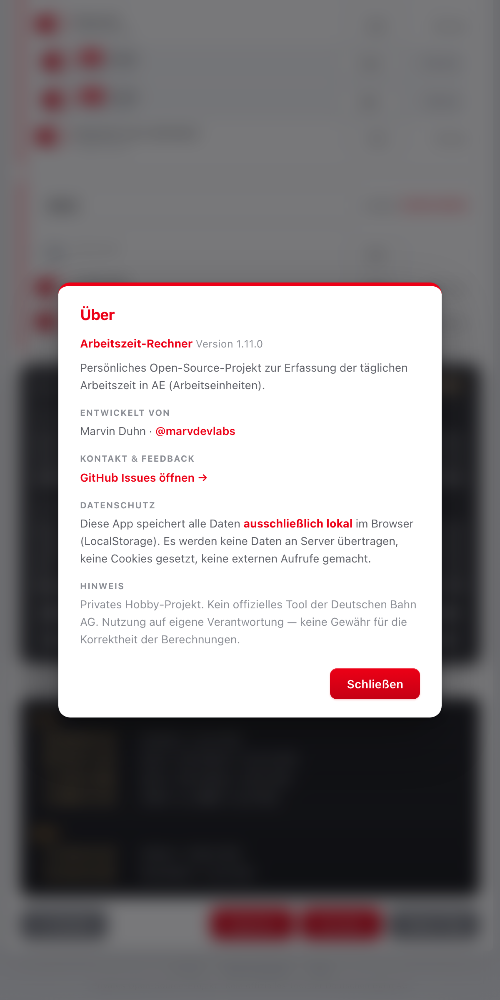

**Privates Open-Source-Projekt** von Marvin Duhn ([@marvdevlabs](https://github.com/marvdevlabs)).

**Kein offizielles Tool der Deutschen Bahn AG.** Die App speichert alle Daten ausschließlich lokal im Browser (LocalStorage). Keine Daten verlassen das Gerät, keine externen Aufrufe, keine Cookies, kein Tracking.

Nutzung auf eigene Verantwortung — keine Gewähr für die Korrektheit der Berechnungen.

Bug-Reports und Feature-Wünsche bitte über [GitHub Issues](https://github.com/marvdevlabs/arbeitszeit/issues).

<br clear="all">
